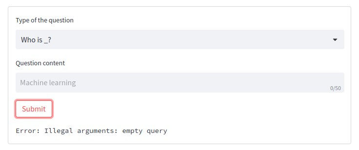

# mini-oracle

**Mini-oracle** can give you answers for two types of question: **Who is _?** and **What is _?**.

It's a full-stack machine-learning application:

- for backend it uses hugging-face [bert-large-uncased-whole-word-masking-finetuned-squad](https://huggingface.co/bert-large-uncased-whole-word-masking-finetuned-squad) model combined with wikipedia REST API
- for frontend it uses:
  - [streamlit](https://streamlit.io/) framework, you can see the application here - [mini-oracle.streamlit.app](https://mini-oracle.streamlit.app/)

## How to use?

### Streamlit (web)

If you prefer a web interface, use the [streamlit application](https://mini-oracle.streamlit.app/).

1. Choose the type of the question:

2. Write the question content:

3. Press the *submit* button and get results:

## What to do if I get an error?

The are several types of the errors you may get:

1. Illegal arguments (*empty query*)

**You should not leave the *question content* empty.**

2. Other errors

This is the most certainly not your fault, you should probably wait and try again. If it doesn't help (even after several tries), you should [let me know](https://github.com/AzimMuradov/mini-oracle/issues).

## How to build from scratch?

**Docs are in progress, be patient ;)**
