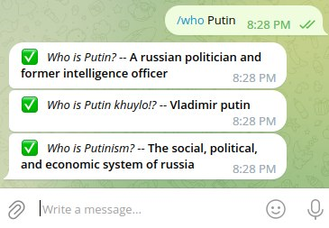

# mini-oracle

![Hugging Face](https://img.shields.io/badge/-Hugging%20Face-white?logo=data:image/png;base64,iVBORw0KGgoAAAANSUhEUgAAACAAAAAgCAYAAABzenr0AAAABGdBTUEAALGPC/xhBQAAACBjSFJNAAB6JgAAgIQAAPoAAACA6AAAdTAAAOpgAAA6mAAAF3CculE8AAAAB3RJTUUH5gwNEQgk0m3AfQAAAAZiS0dEAP8A/wD/oL2nkwAACUpJREFUWMPFl1uMZFd1hr+1zz6nTt27p7q6p2emB88F7BnhS+wolgMmAgNjRJQYQYAQIRErSuCFSxIlUpTkIQ/JQ4KNHQmRSERCQkIIyQwS4mIkiJGVYIEsg2wyDGHGznjG01Ndfanruey9Vx5OTTPGiBDlISXtOiXVWXv9e+3//9fe8P/8kV/mpeGjEFkoC0BvjBbECBoU9Kd/qMBWAr0C1j76fwBw7RMQDER+MXFGQsQqwgngGEJPDKkGSpQhcBHlvHdctXWcAv0aXM1h/WP/CwDDR6GYg00gQiidrorwJlMzbzP15O6ola6ZRtI0iY0xgoaAFt75aT4Nk+yKnxXf1lIfU+XJyDITU83b+8gvAWDrYRCB4IFAC8M7TCP+o7jfvite66T2QAuTWiSKwNwQHhR1npCVlIMxxZWd3XI4/bIW4eO5k2fSWrVF/Y/9AgCDh0EUAiCBV0ti/ipe67wzPd5v2F4LsVFFAv2fNlQIWUlxaZvswrVzfpT/pc95zNRR+RkQ+yGDTywIpkDgTtOwj6QnVl+fHl9FavZlJHtFXqlmcg5stODL4qu8Nmb23ItX3XD20Xqz8fn5fPayStj9CuZgYtDALVEj/sf66UO/nt7Uq8qsWiXhlThEYDxRvvytkmfPe44eMrz9jTFHDhoUiNc6NM2Rg5NnLv3dbGd2WSKe1J8t2tZDlXTU0zU180/1W9bfU3/1WiUzAe9hZ09RYLkj2BsK4hw88pmMT38+ZzpXbCS88R7L3/5pnbUVU70nkL8wZPr9S18Nc/9+sQyvV8ECGKCwhiiEd8UHuw+kx/r7yWdz5bNnC774eIEqvPXemN9/V43lroDA5c3Al75RElvh3W+POX8h8Ox5z08uwlo7JniQSEnWD1BeG92XP7/92yLyLyrVCuyPHwXvQGahbzrxg+mxfk2SxRIFvvbtkkc/k1GUVbk/+dmcWiJ86PdqmMV+r60IZ+61/MkfpFwdKBcvCqfXmpTXEtQbJHGYdkHt8EpSbo7e58fuMUnYBbAnMxjGIIbX2V7rDrvc3N/zsoTvPOOYZ/Dg79Q4tmH4wlcKQoCgIAE21g2f/JsmzTrUU+HY4Yib2inlVhM/SikLwTZLomCI2l2ipcadfjq6HXhi6yGwAws/+hTc8iF5XbzSakgcQYBQGkwQ7r2jRn8p4sF3J/QOCPf/RkyaQLQwF2NgtSf7BNVS8LMYnSU8/VzJ08/PeO8bunTqMbRr2OXWcnl1dA9J9ITkHisCr/kALZPY01GnDl4Ik4QwS1BnOHNbg/vvzrHtEg2BA115hRqu/xYBiWBaBL7+vV3++WvbvOX0MmlNUBPAKLZTR5LotW7H12iS24UW6kSybtIqsd9pEEYpWhpM6pFORLAzTDP/uTJkMfIMnj1X8rkvDvn6v2f86okGv3tfm2QpR+olEjtMM0asOSrWN+A6AIjESAOJ0MwSpglhr04xsezJlNbBiE4jImpLZZXXvcNVKtnaUX5wzvOvT5U8+T3HYKjcfWvMn3+gxcH1DOIS0ywQ6yo3FbOMEN9oRAGlJICq7FvZeO75+BMvsVNmnDwmrK4H2i0IAbJc2Rwql654fvxC4NpWYDqHRgq/dV/Mh9+fcvxQQfAFmFAB9woeBKLrHnQdQKEhbKsrMKkjNEqMy+jVDX/4m12+8N2Sx5+asrkdrqsTHyogUJllqwm/dmvEO8/EvO3emE4Lgnc/bS6h4kqYezToVAS/D0AdM3XhYpjnb7CdgqijhMRhvOHUhucv7qrzviE89YPKbq9sVquNIuh1hWNHDHeeiviVU4aVJQNBCdmCnFoBUBeqJjXOwYcXxTMXC1aBWscWLneXysGYMCvwM0+y1gNjCCaQtBJu7go3H08ocmU+V5wDQUmsUK9BJBC8ErLKJNQrfppXhhGUYriHsZaQl4TSPT+ZM2umVDIsnbvDdtK3lIOxauklObxMduESYg3YCLtbp3a4B1IhbteAuGrLGhQyxQUWyUB9oBjsEMocLQNaONKTffLLO/jJnKiVvr6p2e0iPFO1LM+p5FD3pubtG6hXok5KcuQAUatO/eaD+ElGcXkXzRXNAmG+GLOATn31nHl0Wo3y6h7BF9RPrxN1UmrHelQeozTv2NDkUHcDz6mKP4HVqB69ubg2Rmy0V9tYJr+4RdxvY+oxfpSRnlyl3B7jhjN0P9ki+dSjE4eOHWHsccMZbj6l/po1/O4ck8bE/TbZTwYkR5cRG+2VmyM19eg+PH0TAnfFh5bONF97OMkuDEamWZvZlTblYEy0VMdtjTHNGvF6h2JzlzBx6NgTxo4wWoyxr8bEUY5GJBtdTKtGuT3B9hqUm2Pi1TZROx1nFwZ7jVuP1JJDS2c0cJcBfuiGk2cBmx5faWcXB2OxpkwOLeH35ph2ikSGeK2DBoffyQhjh04Wq58HNAtoqYSihESJD3aRyGA7KX40Jzm6jGnYcf781m56vN8BrNuaPAf8h8FQhNyV83NXR1r4UD+x2kA1iDWgYNtppfXYErVq+GmOFoq6hb5v7AmuJOrWMEllL2YRK7FRDWh6YrUbChfm514ahcIVCLnBs2aXm0cbtx1punE2d7uzvbjftogQdeuE3KF5QGcBgqD6i06kWr0zC1VM7iryIRL3mk23Mx350XzeuG2jaZcbR/GsGYEfue3J2eLFnVn6ql4/Xml3KmUoUSPF2Bphz+EHGW5njrl+CuGGLgSoehRw21P8ICPsOYytETXSyoIV4pV2J71ppV9c3pm67elZEc5Hf3Y/DqdP+71pEjJ30h5odcVEMVkQnQbIIYycz18aZuXu7nYIpQuuiILLouDm+HKGL6aFy8ZjV0wu+CL/L/GmbUzNGhOZ/ZO2iGjpmZ278lJ+cevTWujDGKZy7e9BDKijJpYHoqX6B5P+0mlbb7YppR5mZVHujYblZO8b6v3DqixJdTXrIcQoc6iuZQr/KUJdTPTXcav71rjbOWAacYINmctmo2Kw+0O/N/9UKDlrEnJVEFUY/EN1kPCtGLNTvkpizpgkvgeRFXwYBee+CZwFhjdePqptfzknqklZQXjAWPsmjOmADkJR/ps6Hpd2/ALzEqQ6Fe9Pt/XQonEJRImlGLm6WFIRCpPaqTrHbA9aB6D34Z9Pw+1HYHMAKz2QyBJy11QlUUeWtOzce7ePuf/HVcx/A83R6EK1NrpfAAAAJXRFWHRkYXRlOmNyZWF0ZQAyMDIyLTEyLTEzVDE3OjA4OjMyKzAwOjAwd8pcZAAAACV0RVh0ZGF0ZTptb2RpZnkAMjAyMi0xMi0xM1QxNzowODozMiswMDowMAaX5NgAAAAASUVORK5CYII=)

**Mini-oracle** can give you answers for two types of questions: **Who is _?** and **What is _?**.

It's a full-stack machine-learning application:

- backend:
    - [hugging-face](https://huggingface.co/)
      [bert-large-uncased-whole-word-masking-finetuned-squad](https://huggingface.co/bert-large-uncased-whole-word-masking-finetuned-squad)
      model combined with wikipedia REST API
- frontends:
    - [streamlit](https://streamlit.io/) framework, you can use the application here
      \- [**mini-oracle.streamlit.app**](https://mini-oracle.streamlit.app/)
    - [telegram bot API](https://core.telegram.org/bots/api), you can use the bot here
      \- [**@mini_oracle_bot**](https://t.me/mini_oracle_bot)

## How to use?

### Streamlit (web)

If you prefer a web interface, use the [streamlit application](https://mini-oracle.streamlit.app/).

1. Choose the type of the question:

2. Write the question content:

3. Press the *submit* button and get results:

### Telegram Bot

If you prefer a telegram bot interface, use the [@mini_oracle_bot](https://t.me/mini_oracle_bot).

1. Start the bot:

2. Execute the `/who somebody` or `/what something` commands:

If you need any help, you can always execute the `/help` command:

## What to do if I got an error?

There are several types of the errors you may get:

### Empty query

**You should not leave the *question content* empty.**

### Other errors

This is the most certainly not your fault, you should probably **wait (1-3 minutes) and try again**.
If it doesn't help (even after several tries),
you should [let me know](https://github.com/AzimMuradov/mini-oracle/issues).

## How to build from scratch?

### Backend - python + hugging-face + flask + wikipedia API

1. Acquire **Hugging Face User Access Token** (https://huggingface.co/docs/hub/security-tokens)
   and set it to the `HUGGING_FACE_BEARER_TOKEN` environment variable.
2. Acquire **Wikimedia Personal API token** (https://api.wikimedia.org/wiki/Documentation/Getting_started)
   and set it to the `WIKI_BEARER_TOKEN` environment variable.
3. Set your email (**that you used when registering on the Wikimedia API Portal**) to the `WIKI_EMAIL` environment
   variable.
4. Go to `backend` directory.
5. Install dependencies: `pip install -r requirements.txt`.
6. Run `gunicorn -w 2 backend.src.main:app`. Follow the logs to access your server.

**Remember, there are only one active endpoint:
`<server_address>/answers?question_type=<question_type>&question_content=<question_content>`.**

### Frontend (WEB) - python + streamlit

1. Go to `frontend-streamlit` directory.
2. Optionally change the backend API endpoint (by default it is set to `mini-oracle.up.railway.app`).
3. Install dependencies: `pip install -r requirements.txt`.
4. Run `streamlit run frontend_streamlit/src/main.py`. Follow the logs to access your site.

### Frontend (Telegram Bot) - kotlin + telegram bot API

1. Create your bot using `@BotFather` bot (https://core.telegram.org/bots#how-do-i-create-a-bot)
   and set the token of your newly created bot to the `TELEGRAM_BOT_TOKEN` environment variable.
2. Go to `frontend-telegram-bot` directory.
3. Optionally change the backend API endpoint (by default it is set to `mini-oracle.up.railway.app`).
4. Run `./gradlew run` (or `.\gradlew.bat run` for Windows). Your bot must be up and running.
