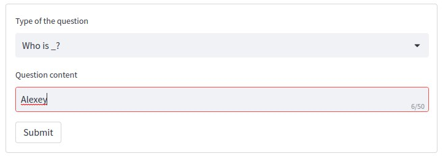
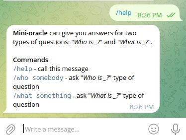

# mini-oracle

**Mini-oracle** can give you answers for two types of questions: **Who is _?** and **What is _?**.

It's a full-stack machine-learning application:

- for backend it uses **hugging-face**
  [bert-large-uncased-whole-word-masking-finetuned-squad](https://huggingface.co/bert-large-uncased-whole-word-masking-finetuned-squad)
  model combined with **wikipedia REST API**
- for frontend it uses:
    - [**streamlit**](https://streamlit.io/) framework, you can see the application here
      \- [mini-oracle.streamlit.app](https://mini-oracle.streamlit.app/)
    - [**telegram bot API**](https://core.telegram.org/bots/api), you can see the bot here
      \- [@mini_oracle_bot](https://t.me/mini_oracle_bot)

## How to use?

### Streamlit (web)

If you prefer a web interface, use the [streamlit application](https://mini-oracle.streamlit.app/).

1. Choose the type of the question:

2. Write the question content:

3. Press the *submit* button and get results:

### Telegram Bot

If you prefer a telegram bot interface, use the [@mini_oracle_bot](https://t.me/mini_oracle_bot).

1. Start the bot:

2. Execute the `/who somebody` or `/what something` commands:

If you need any help, you can always execute the `/help` command:

## What to do if I got an error?

There are several types of the errors you may get:

1. Empty query

**You should not leave the *question content* empty.**

2. Other errors

This is the most certainly not your fault, you should probably wait (1-3 minutes) and try again.
If it doesn't help (even after several tries),
you should [let me know](https://github.com/AzimMuradov/mini-oracle/issues).

## How to build from scratch?

### Backend - python + hugging-face + flask + wikipedia API

1. Acquire **Hugging Face User Access Token** (https://huggingface.co/docs/hub/security-tokens)
   and set it to the `HUGGING_FACE_BEARER_TOKEN` environment variable.
2. Acquire **Wikimedia Personal API token** (https://api.wikimedia.org/wiki/Documentation/Getting_started)
   and set it to the `WIKI_BEARER_TOKEN` environment variable.
3. Set your email (**that you used when registering on the Wikimedia API Portal**) to the `WIKI_EMAIL` environment
   variable.
4. Go to `backend` directory.
5. Install dependencies: `pip install -r requirements.txt`.
6. Run `gunicorn -w 2 backend.src.main:app`. Follow the logs to access your server.

**Remember, there are only one active endpoint:
`<server_address>/answers?question_type=<question_type>&question_content=<question_content>`.**

### Frontend (WEB) - python + streamlit

1. Go to `frontend-streamlit` directory.
2. Optionally change the backend API endpoint (by default it is set to `mini-oracle.up.railway.app`).
3. Install dependencies: `pip install -r requirements.txt`.
4. Run `streamlit run frontend_streamlit/src/main.py`. Follow the logs to access your site.

### Frontend (Telegram Bot) - kotlin + telegram bot API

1. Create your bot using `@BotFather` bot (https://core.telegram.org/bots#how-do-i-create-a-bot)
   and set the token of your newly created bot to the `TELEGRAM_BOT_TOKEN` environment variable.
2. Go to `frontend-telegram-bot` directory.
3. Optionally change the backend API endpoint (by default it is set to `mini-oracle.up.railway.app`).
4. Run `./gradlew run` (or `.\gradlew.bat` run for Windows). Your bot must be up and running.
